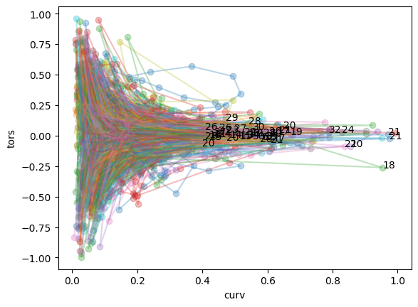
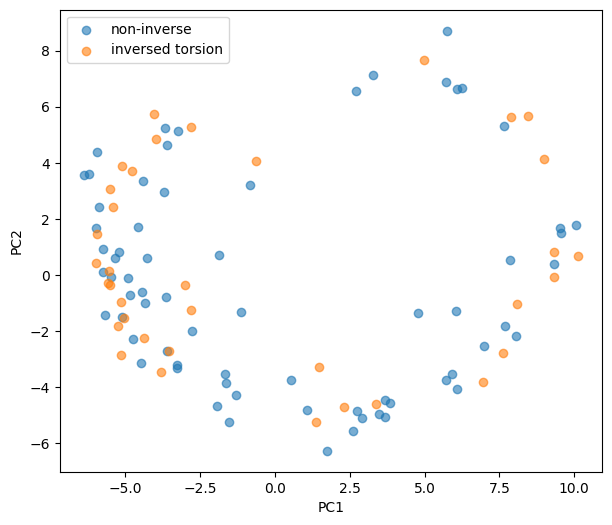
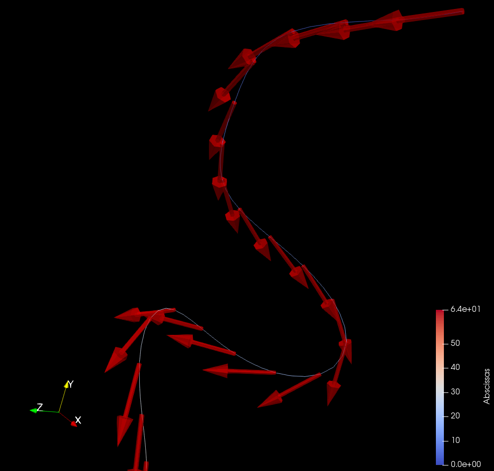
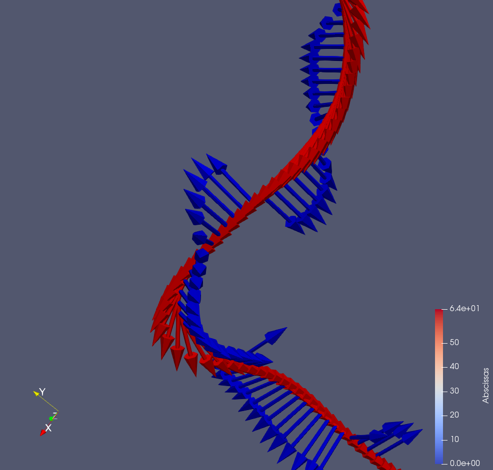

# 寻找curvature较大时torsion
- data from standardization.ipynb 

## Method 1 (V-modelerで計算したtorsion)
- 特徴：torsion只有在curvature值较大时才有意义
- 采用与Automated landmarking and geometric characterization of the carotid siphon（Bogunović）的(k1, k2)空间类似的思路，以curvature为横轴，torsion为纵轴，作出每条中心线上curv和tors的关系图 **（已经筛去所有curv>1和abs(tors)>1的线）**

  
数字为curv>0.4且tors反转的node的编号。

- 这种分类方法在双轴（tw_results）PCA上的结果不明显。    

 

### Method 1结论：coord PCA无法对torsion分类

## Method 2 (vmtkcenterlinegeometry)
### issue
- 首先vmtk计算出的曲率可能就不太对（tangent并未指着曲线行进方向）？
   
- binorm的方向并不uniform，说明在一些直溜的地方torsion可能突变了

# 寻找curve peak
## 方法
- 
# 寻找curv duration
- 
# 寻找curv location
- 