# Standardization = z-score normalization
- *data from standardization.ipynb*
- 元データの平均を0に、標準偏差が1に変換する。

$
x_{new}^{i}=\frac{x^i-\mu}{\sigma}
$

1. (104,64,3)に対してzscoreをかける
2. x, y, z軸に分けてzscoreをかける
1と2で得られた結果は同じである。（検証済み）

## Result
standardization前後データの形（？）が変わらないことを示す。  
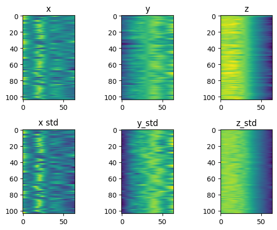

### PCA
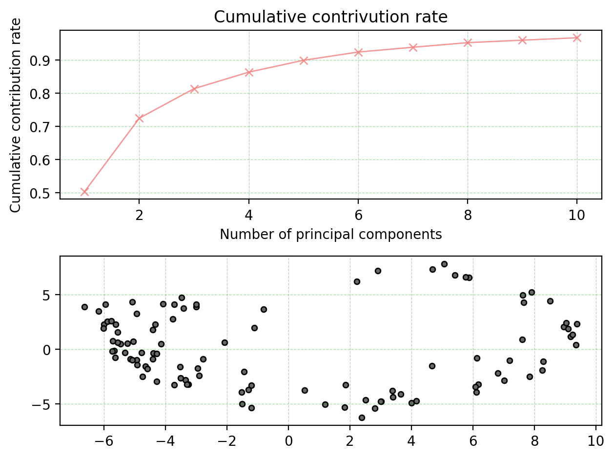
### Kmeans clustering
- cluster=3とする  
- 円周上に分布する傾向が見られた  
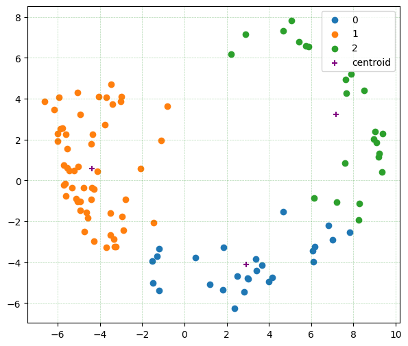

# rotationにより、z軸を消す
- オリジナルノード配置(centroidを(0,0,0)にするalignment済)    
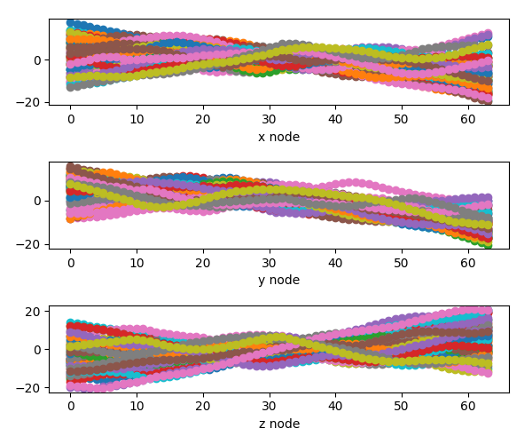
- rotation  
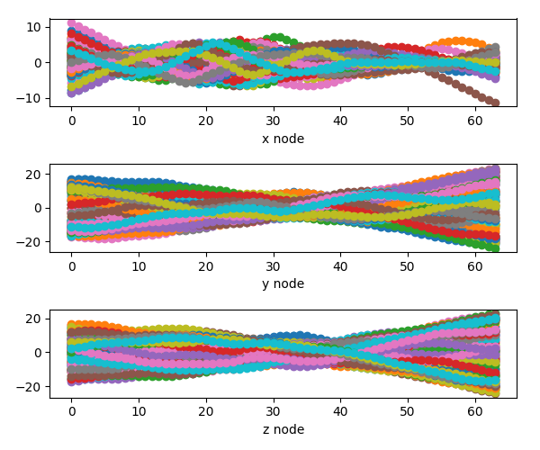
- Procrustes。y, zノードが線形に近い配置になっている  
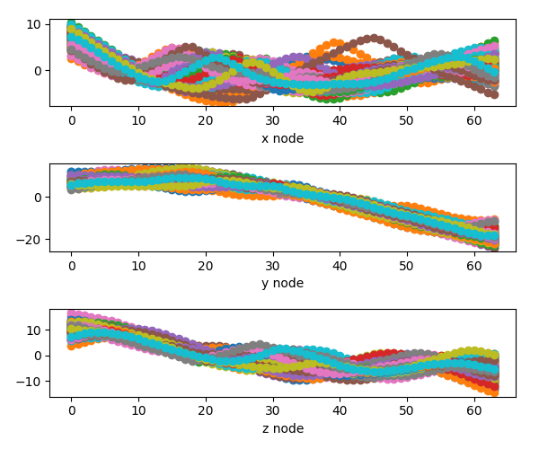

## この処理の結果
distal, proximalが一致

## 以降、再standardizationを行い、PCAを行う
- clustering結果は変わらない、PCAにより変換した座標もx,y,z三軸のときとくらべてほぼ変わらない。  
- 図：○は（x,y,z）で訓練したPCAモデルresult,　ｘはrotation後、(x,y)だけで訓練したもの  
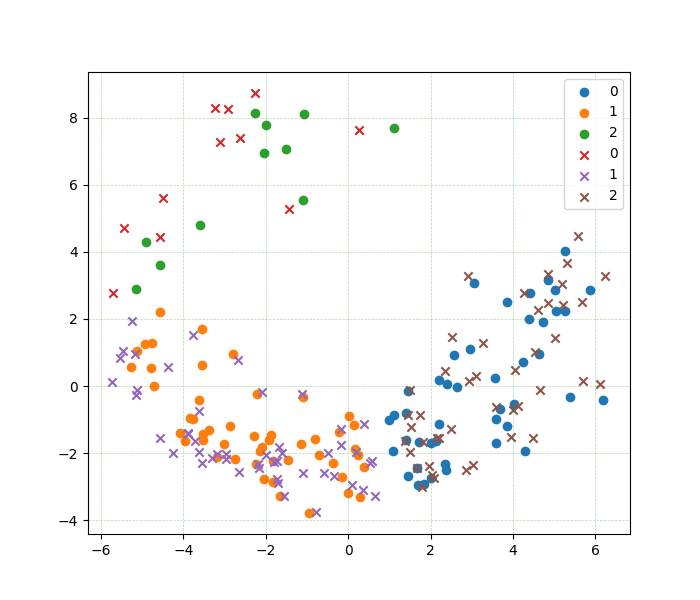

## 各モードについて考察
- パラメータはすべてvmtkにより計算。
### BraVaデータの係数分布
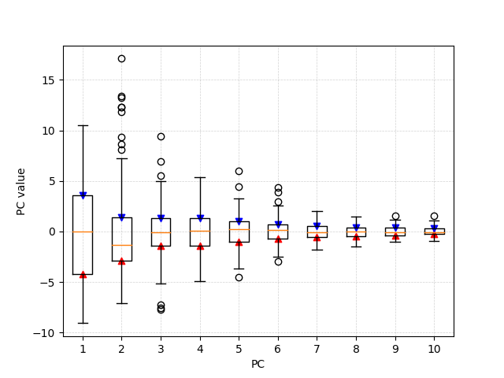

### 線形
- PC2以降0に固定、PC1だけ線形に変えてみる. すなわち、定数倍モード1だけ支配する形状
- 左図：bold gray line:current shape(x position), gray point line: mean shape(x position), red line: current curvature, purple line: previous curvature, yellow line: next curvature.
- 右図：km=3のときのk-means clustering結果、右図のprevious/current/next curveが対応するPC1とPC2の分布状況   
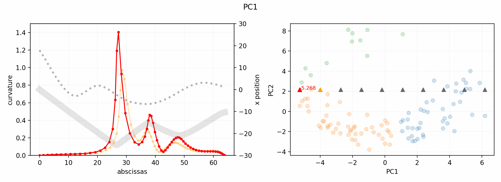
- PC3以降およびPC1を0に固定、PC2だけ線形に変えてみる. すなわち、定数倍モード2だけ支配する形状  
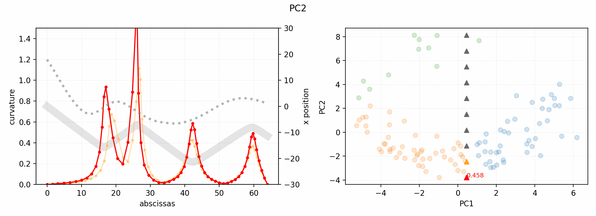
### 円周
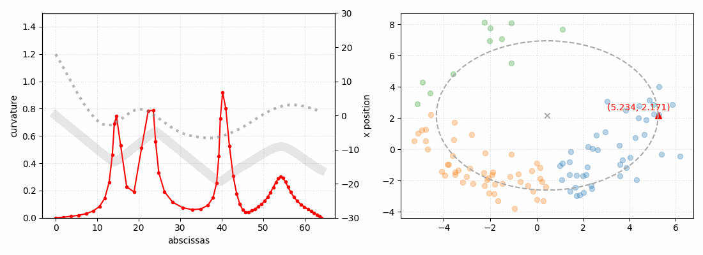

# 「あらゆる曲線」のPCAモデルを訓練して、「BraVa ICA」の係数分布を考察すべき